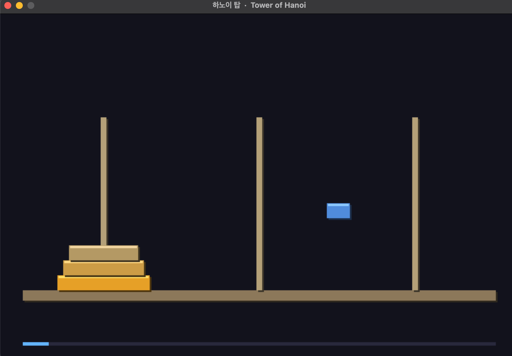

## Overview 
- a tiny tower of hanoi implementation with SDL2, first time using auto_play (I dont like it but whatever)
### Run 
```sh
brew install sdl2
```
Run the program:
```sh
g++ -std=c++17 -O2 -Wall -Wextra code.cpp -o tiny_hanoi -I/opt/homebrew/include -I/opt/homebrew/include/SDL2 -D_THREAD_SAFE -L/opt/homebrew/lib -lSDL2
./tiny_hanoi
```

> Screenshot from the application 
### Ressources 
- [Wenyan Showcase projects](https://ide.wy-lang.org/?file=hanoi)
- [Wikipedia](https://en.wikipedia.org/wiki/Tower_of_Hanoi)
